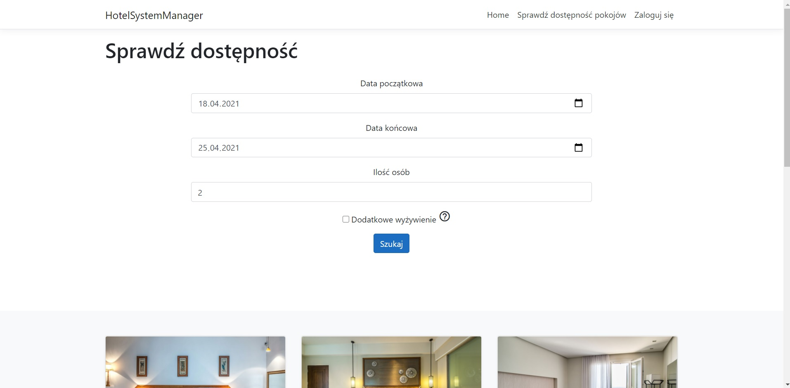
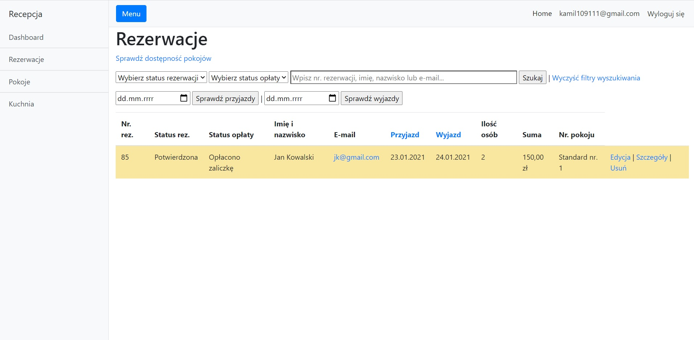
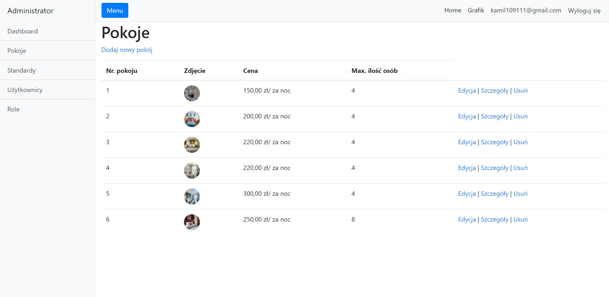

# Hotel System Manager

Hotel System Manager is web app developed for managing various activities in hotel.

## General info

Application contains two parts. First part is for guests and the second part is for hotel employees and administrators.

## Technologies
* ASP.NET Core 3.1 
* Bootstrap 4

## Features
List of features 

As a Guest you can:
* check the hotel offer
* book a room

As a Hotel Employee you can:
* manage bookings
* manage payments

As an Administrator you can:
* manage room
* manage user accounts

## Screenshots

Room availability form

Employee menu

Admin menu

